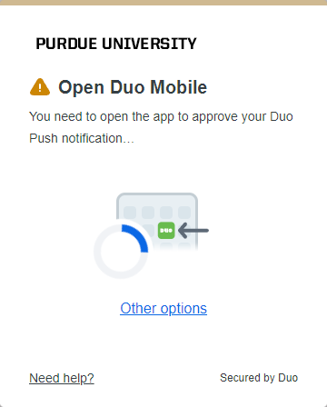
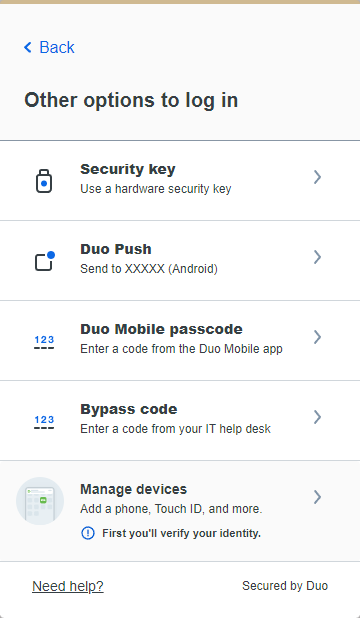
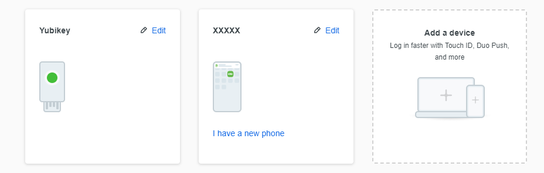
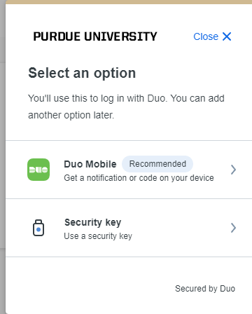
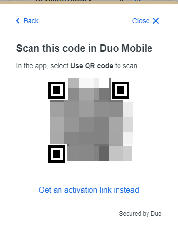

# Initial Setup

## Getting Activation Code

1. Login normally and when you see the Duo Prompt, click on `Other Options`.

    

2. Click on `Manage Devices` (and verify your identity if prompted).

    

3. Click on `Add a device`.

    

4. Click on `Duo Mobile`.
    
    

5. Follow the instructions until you see a QR code, then click on `Get an activation link instead`.
   
    

Now you should have an activation link looking like this: `https://m-1b9bef70.duosecurity.com/activate/XXXXXXXXXXXXXXXXXX`, and the last part (XXXXXXXXXXXXXXXXXX in this case) is your activation code.

## Setting up browser extension

Put the activation code in the `Duo Mobile Activation Code` field in the extension's options page, fill in other fields as needed, and click on `Submit`.

## You're all set!

Now click on `Auto Log in` on Purdue's login page and you should be able to log in automatically.

